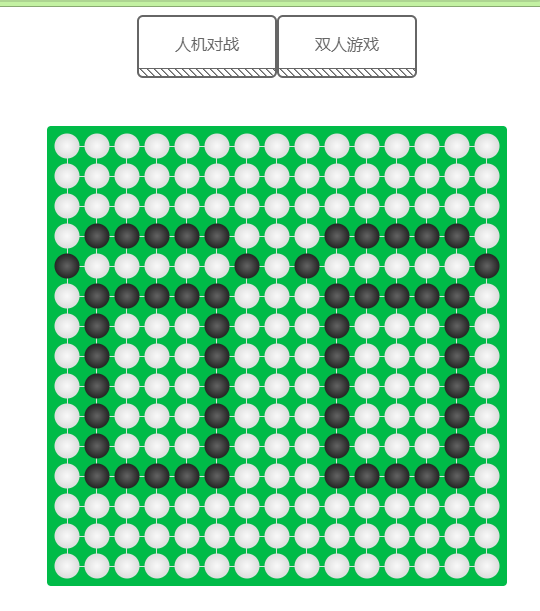

# 五子棋

> refer [https://codepen.io/lvanboy/pen/JWgPvP](https://codepen.io/lvanboy/pen/JWgPvP);

## 案例

[https://liar0320.github.io/GoBang---/dist/](https://liar0320.github.io/GoBang---/dist/)

## 主要依赖

- [react](https://react.docschina.org/) 用于构建用户界面的 JavaScript 库
- [redux](https://www.redux.org.cn/)Redux 是 JavaScript 状态容器，提供可预测化的状态管理。
- [Redux 状态预览（Redux DevTools extension）](https://github.com/zalmoxisus/redux-devtools-extension)

## 安装

Clone the repo using Git:

```base
git clone https://github.com/Liar0320/gis.GoBang---.git
```

Alternatively you can download this repository and then:

```base
npm i
npm run start
```

## 打包

```base
npm run build #打包当前项目
```

## 预览


